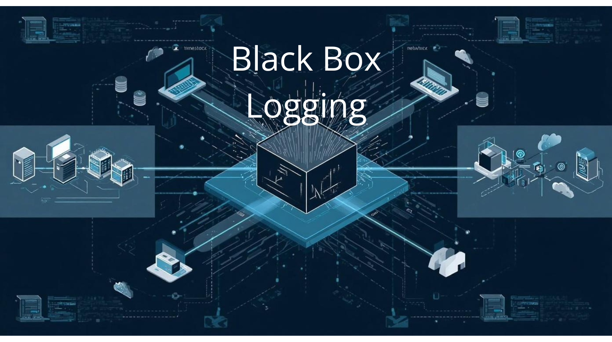
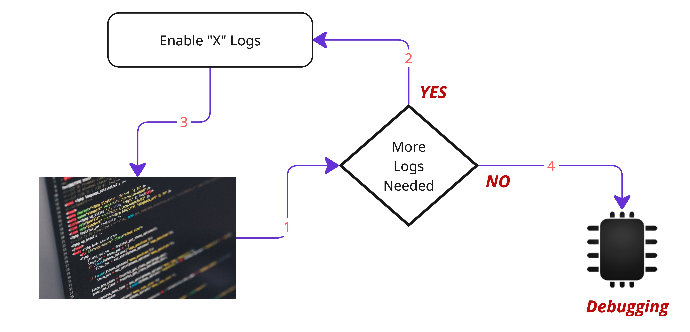
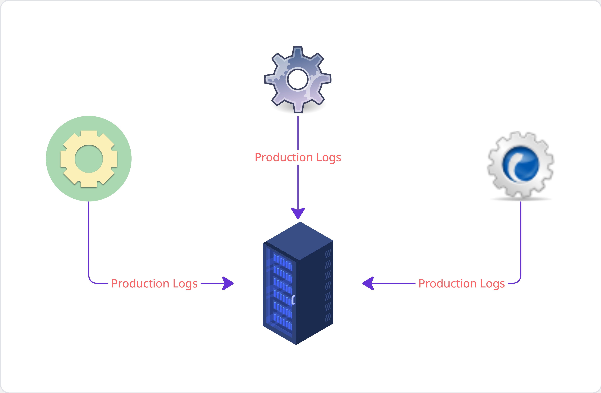

***

# Black Box Logging — Faster, Efficient and Actually Useful

The Architectural Framework of Black Box Logging 

#### The Truth

*   *As long as there are ****softwares****, there will be ****bugs***
*   *As long as there are ****bugs****, there will be a need to ****debug**** them*
*   *As long as there is a need to ****debug**** them, there will be a need to have ****logs ****(even for A.I.)*
*   *As long as ****logs ****are needed, there will be a need to capture as much ****system run time information**** as possible in the logs to increase our ****chances of success (o****f anyone looking at the logs and trying to fix the problem****)****.*

***

#### The Solution

Write detailed enough logs in the system which can capture good enough run time information which can be used to understand the system state for debugging.

Application writing the logs

> The solution look easy. Well its actually is,.. but there is a problem. 

***

#### The problem of Abundance

Writing logs is not a problem, in fact, we can write as much detailed logs as possible, the real problem comes with the creation and storing of the logs.

The creation of the logs takes ***processing time (CPU) ***and storing them takes ***processing time (CPU)**** *as well as a significant amount of ***storage space (Disk Space)***.

> *The processing time and disk storage which could otherwise be used by the system or to lower down the overall infrastructure cost*

In general, the amount of logs generated from the system is directly proportional to the performance impact on the system.

> More the logs, slower the system will be.

The factory of Speed and Infrastructure requirements of logs

***

#### How we’re solving this problem as of now?

> *By not writing the logs and it’s not a mistake or an unreasonable choice. *

> All logs are rarely required, most of it will be required only when we need to debug the system.

Hence the obvious solution is to keep the logs in disabled state which can be enabled or disabled dynamically when ***“Something”*** happens or when we need to “***debug”*** the software

To facilitate this, the common practices is to create different category of logs which is enabled and disabled based on the need.

#### The Category of Logs

Here are some of the common categories of logs which might be used in the production system

*   ***Critical Logs :-*** The logs that will absolutely be needed and will be generated from all production code
*   ***Debug Logs :- ***The logs that will be enabled to debug a functionality or the system behaviour
*   ***Info Logs :-*** The logs that will enabled to generate information about the system run time behaviour
*   ***General Logs :-*** The logs written during the development and is mostly present in the non-release version of the software.

These are some of the general ones, but many organizations and teams may have their own general as well as specific categories. 

> **However, the bottomline is that in the production systems, most often than not, only critical category logs are written to enable high performance and to reduce the infrastructure cost**

***

#### Logs and Debugging

*Whenever production system doesn’t behaves as expected, we often find ourselves in a position where the existing logs (mainly critical and some info logs) are not sufficient enough for understanding the root cause of the issue.*

The only probable way to proceed further is to enable desired additional logs and then wait for the problem to reoccur once again and hopefully the additional logs will be good enough to understand the root cause and fix the issue.

Generating Logs for Debugging

> As far as my experience of being a software developer goes, this method is not only time consuming but at the same time highly inefficient. 

The additional logs also changes the system behaviour, which sometimes actually prevented the problem or may cause some other problem

***

> **As an example, once I wanted to debug a race condition, however, enabling logs prevented the conditions to occur because of the additional execution time the thread took.**

***

*Not saying that its not helpful, but not always, not all the time*

***

#### So What shall we do?

*The answer lies in* ***Black Box Logging. ****Enable production logs with minimal costs*

***

#### What is Black Box Logging ?

Keeping Production Logs as Black Boxes

***Black box logging*** is an architectural framework which helps systems to process and store the system runtime behaviour logs in an encoded format (using hash identifiers) without incurring lots of ***processing power(CPU)*** and ***disk storage***.

As yes, its always on logging. Its enabled by default in the production system and it keeps on writing the logs all the time.

***

#### Why it's called the Black Box Logging ?

The core idea of *BBL (Black Box Logging)* logging comes from the black boxes that are present in transportation vehicles like Airplanes. 

The Black Box store the system run time information and everything else that is needed for the understanding of the state of the system for a specific duration i.e “X” hours.

> **There is no option as well as the concept of re-run with additional logs to understand the problem in the back box based systems.**

Also, these logs are not understandable in its raw form. One needs a different decoding machine to decode and understand the software.

The similar setup can be implemented in any production system software where runtime information will be logged in the encoded format, which can be decoded if needed by using an external system

***

#### The Black Box Logging — Encoding of the system states

Each software systems runtime consist of a set of known states (expected & non-expected (errors)) and unpredictable states. The idea behind black box debugging is to encode those states using a ***hash identifier***. 

The ***hash identifier*** can uniquely identifies the parameters of the system state. The simplest possible hello world examples could be the following

    Hash Identified "1" - # System is Normal
    Hash Identified "2" - # System components A & B are Normal C is NOT
    Hash Identified "3" - # Error in Component A
    Hash Identified "4" - # Error in Component B
    and so on....!

These are just crude hello world examples, in reality, while building your systems, you need to work on or use the AI to create ***hash identifier*** for various states.

In fact, you’ll end up having ***hash identifiers ***for all the files, classes, functions, API calls, expected, exceptions and non-expected outcomes. 

> Not easy, but one time job. The **hash identifiers **will be like the unit test cases. Build as you go, build **hash identifiers** for your system states as you build

***

#### Processing and Storing the Logs

In the source code, the hash identifiers will be hardcoded based on the execution scenario. No additional details will be required, just the ***hash identifiers***

    if API_call_is_successful:
      encoded_logs_add_hash_id("123")
    else:
      encoded_logs_add_hash_id("567")

***

#### The Hash Identifier Database

For ***Black Box Logging*** to work, we need to create an offline database as part of the creation of ***hash identifiers. ***

***

*A simple Key-Value data store (in-memory or persistent) works for the mapping ****hash identifiers. ***

***

The database is neither used in the production code, nor shipped along. The data is just used for decoding the logs if an when required. The logs can also be kept in the long term storage with the corresponding ***hash identifiers*** as a metadata of the logs

An example of a simple ***key-value hash identifier database ***could look like this

    Key-Value-Hash-Identifier-Database

    hash_identifier , description
    1, APICall class is initialized
    2, URL is assigned to
    3, https://www.theoryofcode.com
    4, payload is set to
    l, python
    e, High
    t, Json
    5, dummy response

*so instead of writing things like ****“APICall class is initialized”**** or URL is set to ****“https://www.thetheoryofcode”****, we will write ****“1”**** and ****“3”****.*

#### Understanding the logs — Decoding the hash identifiers

The logs generated by the production system can be rotated based on the logs rotation policy. However, if something goes wrong and we need to debug the same, we can take the logs and decode the same externally from the production system by using as ***hash identifier decoder*** which achieves the same using ***hash identifier database***

***

#### Black Box Logging is for all programming languages 

The architectural framework of ***Black Box Logging*** can be implemented in all programming languages and is easy to do. 

However, I intend to provide sample and wrapper implementation of the same in 6–7 widely used programming languages. Please keep a watch on my github page

***

#### Example — Python Code for API Call. 

Here is a simple python hello world class which is implemented using*** Black Box Logging***. Here instead of writing information about the state of the system, we’re just writing the ***hash identifier ***to depict the system states.

This code is based on the hash identifier database shared above

    # The logger class, which will add the hash identifiers
    # in an array. 
    class Logger:
        def __init__(self):
            self.log_list = []

        def add_to_log(self, log_entry):
            self.log_list.append(log_entry)

In most of the production level code, you’ll write the logs in the log files. Python array is used here just as a hello world reference implementation

Below is the APICall class which will use the 

    # The functions of this class will just write the hash idetifiers
    # in the logs instead any textual information

    class APICall:
        def __init__(self, logger_instance):
            logger_instance.add_to_log("1")
            self.url = ""
            self.payload = {}

        def set_url(self, url, logger_instance):
            logger_instance.add_to_log("2")
            logger_instance.add_to_log("3")
            self.url = url

        def set_payload(self, payload, logger_instance):
            logger_instance.add_to_log("4")

            for key, _ in payload.items():
                logger_instance.add_to_log(f"{key}")
            self.payload = payload

        def call_api(self, logger_instance):
            api_call_param = self.url + self.payload.__str__()
            resp = "dummy response"
            logger_instance.add_to_log("5")
            return resp

Here is how the sample calling of the APICall class

    if __name__ == "__main__":
        logger_inst = Logger()

        api_call = APICall(logger_inst)
        api_call.set_url("https://www.theoryofcode.com/", logger_inst)
        api_call.set_payload({"l":"python", "e" : "High", "t" : "Json"}, logger_inst)
        response = api_call.call_api(logger_inst)
        print(response)

To decode the logs we can add the following lines 

    if __name__ == "__main__":
     
        #....
        # Existing code
        #.......
        #
        
        # raw logs in the form of hash_keys
        print(logger_inst.log_list)

        # print the logs
        decode_the_logs(logger_inst.log_list)

And here is how the output of the last two lines will look like

    ['1', '2', '3', '4', 'l', 'e', 't', '5']

    # decoded data in sequence
     
     APICall class is initialized
     URL is assigned to
     https://www.theoryofcode.com
     payload is set to
     python
     High
     Json
     dummy response

With Black Box Logging, we store only ***8 hash identifiers,*** instead of ***21 words*** as described above. In reality the hash identifiers can be much smaller for wide variety of system responses.

Just as in python, it can be implemented in pretty much all known programming languages.

#### Okay, What’s next?

Do it, save you logs, save your time, save you effort and cost and then thank me later :)

If you’re facing any difficulties in implementing Black Box Logging, will be more than happy to do it for you once. Reach out to me..

Thanks for reading….

Daksh
